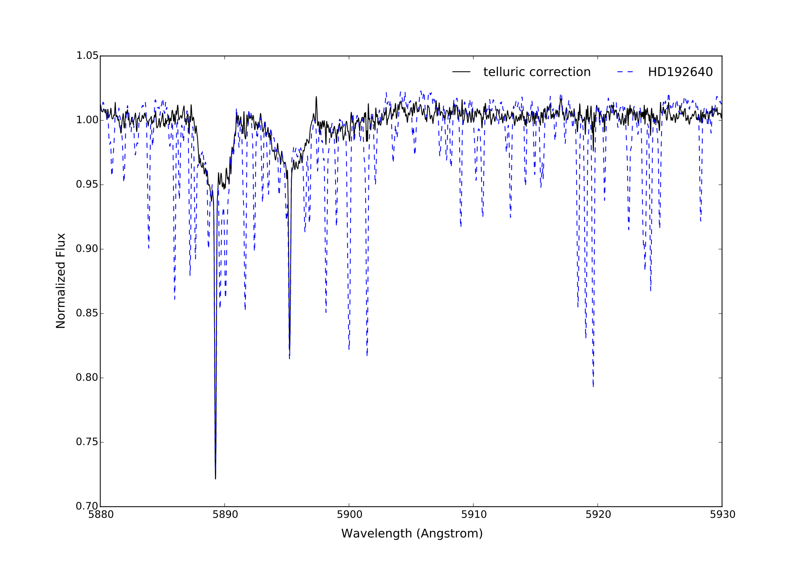
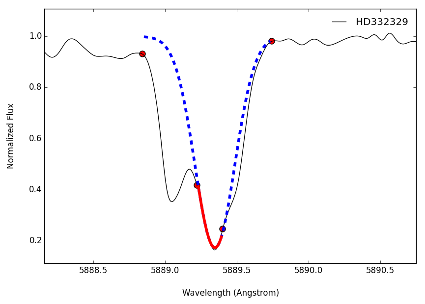
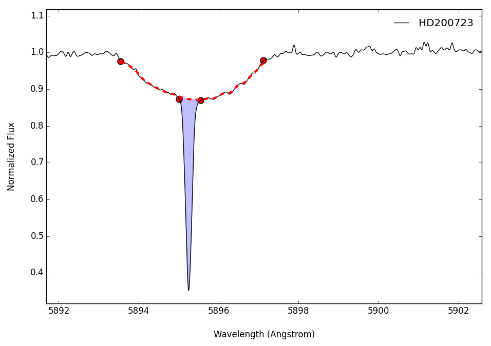
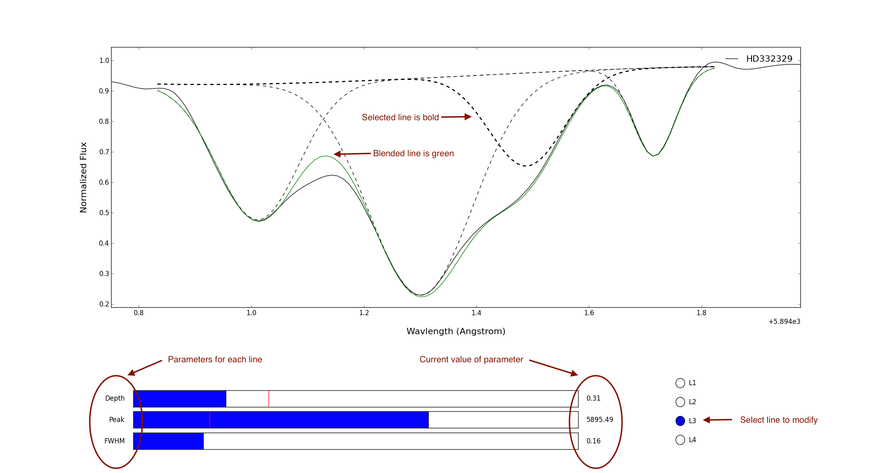
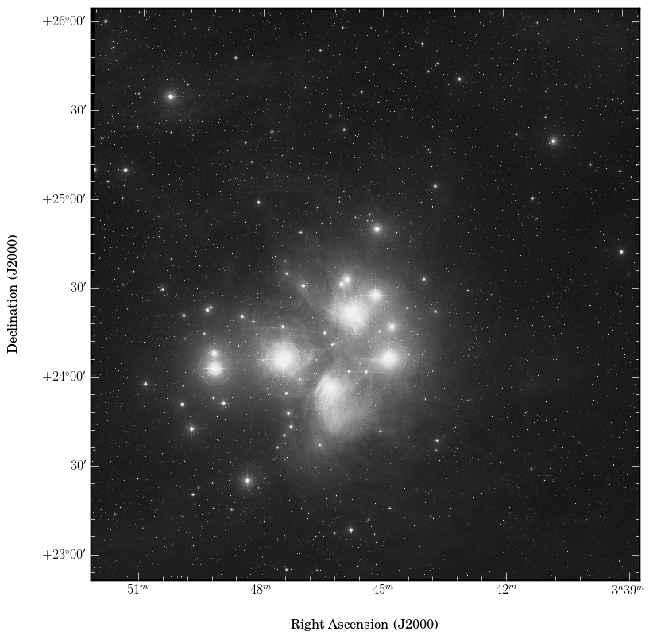

# [SLiPy](http://glentner.github.io/SLiPy)

#### A Spectroscopy and astrophysics Library for Python 3

This Python package is an expanding code base for doing computational
astronomy, particularly spectroscopy. It contains both a *Spectrum* class
for handling spectra as objects (with +, -, \*, /, etc... operations defined)
and a growing suite of analysis tools.

**Dependencies:**
Python 3.x,
[astropy](http://www.astropy.org),
[matplotlib](http://matplotlib.org),
[numpy](http://www.numpy.org),
[scipy](http://www.scipy.org)

[](http://www.astropy.org/)
[](http://www.gnu.org/copyleft/gpl.html)

Quick note: the subpackage **astrolibpy** was not developed
by me. It was coded by Sergey Koposov (@segasai) at Cambridge (then at least).
I found it useful for performing velocity corrections on my spectroscopic
data. I've modified several modules such that it can be imported and used in
Python 3.x. See his README file.

## Contents

SLiPy is split into several components. The principle component is the
subpackage **SLiPy** itself, which contains all the relevant
functionality. Further, **Data** is a package I'm working on that will provide
an API for searching astronomical data archives in a simple way. The other two
subpackages **Framework** and **astrolibpy** are of utility to the project but
not necessarily intended for export. As stated previously, astrolibpy was not
developed by me, only modified. I'm not going to document it's usage here. Its
name is unfortunate for me as it is a bit over done with the convention I was
already using, but for consistency I will keep it as it was from the author.

The following modules are elevated to the package level and are available
to import:

| SLiPy/ | Functions/Classes |
|---------|-------------------|
|[**Spectrum**](#SpectrumLoc)|[WaveVector](#WaveVectorLoc), [Spectrum](#SpectrumLoc), |
|[**Fits**](#FitsLoc)|[Find](#FindLoc), [RFind](#RFindLoc), [GetData](#GetDataLoc), [Header](#HeaderLoc), [Search](#SearchLoc), [PositionSort](#PositionSortLoc), |
|[**Simbad**](#SimbadLoc)|[Position](#PositionLoc), [Distance](#DistanceLoc), [Sptype](#SptypeLoc), [IDList](#IDListLoc), |
|[**Correlate**](#CorrelateLoc)|[XCorr](#XCorrLoc), |
|[**Telluric**](#TelluricLoc)|[Correct](#CorrectLoc), |
|[**Velocity**](#VelocityLoc)|[HelioCorrect](#HelioCorrectLoc), [BaryCorrect](#BaryCorrectLoc), [IrafInput](#IrafInputLoc),  |
|[**Observatory**](#ObservatoryLoc)|[...](#OHPLoc), |
|[**Plot**](#PlotLoc)|[SPlot](#SPlotLoc), [Iterate](#IterateLoc), |
|[**Profile**](#ProfileLoc)|[Select](#SelectLoc), [Fit](#FitLoc), [Extract](#ExtractLoc),   |
|[**Montage**](#MontageLoc)|[SolveGrid](#MSolveGridLoc), [Mosaic](#MMosaicLoc), [SubField](#MSubFieldLoc), [Field](#MFieldLoc), |

<br>

| SLiPy/Data | Functions/Classes |
|------------|-------------------|
|[**Elodie**](#ElodieLoc)|[Archive](#EArchiveLoc), [Script](#EScriptLoc), [Download](#EDownloadLoc), |
|[**Atomic**](#AtomicLoc)|[Ions](#IonsLoc), |

## Installation

To install SLiPy, there is no setup procedure. Simply download the package,
either by clicking on the download link for a *tar* or *zip* archive or by
cloning it.

Extract it's contents to wherever you like in a directory (ostensibly named
*slipy*, but actually you can call this library whatever you want as well
because all the imports are *relative*). Then add the parent directory to your
*PYTHONPATH* if it isn't already. For example:

```
$ cd
$ git clone http://github.com/glentner/slipy
$ echo "export PYTHONPATH=$PYTHONPATH:~" >> ~/.bashrc
```

And your ready to go!

## Exceptions

SLiPy attempts to catch all foreseeable exceptions and re-throw them under a
common handle with a human readable message. There is a unique exception class
for every module, all derived from a common *SlipyError*. The naming convention
is for a module's exception to be named after the module with the addition of
the word *Error*. So the *Fits* module will throw a *FitsError*. These are meant
to handle erros internally. The user need not worry about these in an
interactive session; however, inside of scipts you might catch *SlipyError*.
For finer control, catch the individual exceptions (e.g., *Fits.FitsError*).

## Contribute

If you use SLiPy or have your own code related to spectroscopy or computing
for astronomy and think it would be a useful addition (or you find a
bug/mistake) I'm more than open to suggested contributions/additions.

## Author(s)

[Geoffrey Lentner](http://glentner.github.io), B.S.  
Graduate Research Assistant  
Department of Physics & Astronomy  
University of Louisville

Significant intellectual contributions have been made by my thesis advisor,
specifically in terms of the science behind much of this package.

[James Lauroesch](http://www.physics.louisville.edu/jtl/), Ph.D.  
Associate Professor  
Department of Physics & Astronomy  
University of Louisville


##Acknowledge SLiPy

If you have made use of SLiPy in your project/research, you can acknowledge
your use in the following ways:

**Publications**  
This research has made use of SLiPy, an open source spectroscopy and
astrophysics library for Python 3 (G. Lentner, 2015).

**Projects**  
If your code either makes use of or borrows from SLiPy, a good way to reference
this is with a [shield](http://shields.io) in your README file.

[](http://glentner.github.io/SLiPy)

The above badge is generated using the following snippet
```
[](http://glentner.github.io/SLiPy)
```

# Documentation

<br>
##<a name=SpectrumLoc></a>[Spectrum](SLiPy/Spectrum.py)

Objects for representing astronomical data. Currently, this includes the
*Spectrum* class and it's helper function *WaveVector*.

<a name=WaveVectorLoc></a>
- **WaveVector** ( *rpix*, *rval*, *delt*, *npix* ):

    Construct numpy array of wavelength values where *rpix* is the reference
    pixel index, *rval* is the wavelength at reference pixel, *delt* is the
    resolutions (delta lambda), and *npix* is the length of desired array.

<a name=SpectrumLoc></a>
- class **Spectrum** ( \**args*, \*\**kwargs* ):

	The Spectrum object is a container class for a data array and its
	corresponding wavelength array.

	There are a few ways to create a Spectrum. If a single string
	argument is given, it is taken as a file name and used to read in
	data from a FITS file. With the keyword argument *wavecal* set as
	True (the default case), elements are read from the header to create
	a corresponding wavelength array to go with the data.

    | Options   | Defaults       | Descriptions                   |
    |-----------|----------------|--------------------------------|
    | *wavecal* | True           | fit wavelength vector to data  |
    | *crpix1*  | 'crpix1'       | reference pixel header keyword |
    | *crval1*  | 'crval1'       | value at reference pixel       |
    | *cdelt1*  | 'cdelt1'       | resolution (delta lambda)      |
    | *xunits*  | 'Angstrom'     | units for wavelength array     |
    | *yunits*  | ''             | units for data array           |

	<br>
	If an array-like object is given, it is converted to a numpy array and
	taken as the spectrum data. A wavelength array will be generated that
	is simply an index (pixel) count. But if a second argument is provided,
	it will serve as the wavelength array. These must be equal in length
	however.

	Units will be imposed for these arrays. When initialized from a file,
	the default units are *Angstrom* and *dimensionless_unscaled* for the
	wavelength and data arrays respectively. Alternatives can be applied
	by providing the keyword arguments *xunits* and *yunits*. If
	initialized via an array-like object, *dimensionless_unscaled* will
	only be applied if no units are detected. If no wavelength array is
	provided, the generated wavelength array will have *pixel* units.
	Units are again only applied if none are detected for the given array.

	Addition, subtraction, multiplication, and division (including in-place
	operations, e.g., '+=') are defined for both spectrum on spectrum
	operations as well as scalar operations. When two spectra are operated on,
	the LHS spectrum takes precedent. One of the spectra must be contained
	within the other (i.e., their wavelength domain is either equal to or
	entirely interior to the other). The outer spectrum is resampled onto the
	inner spectrum's pixel space and the operation is applied element-wise.
	To state it briefly, only the affected region of the LHS spectrum is
	operated on. This makes units dangerous for multiplication and division.
	Only in the case of multiplying/dividing spectra of equivilent wavelength
	arrays will the units be properly applied. Otherwise, the RHS units will
	be ignored. Considering the physical context within which it makes sense
	to apply these operations to spectra this is justified; the data will have
	`dimensionless` units in all likelihood. For scalar addition and
	subtraction, if no units are given the units are implied to be the same as
	that of the data.

	The comparison operations ( >, <, >=, <=, ==, !=, &, ^, | ) are defined
	to return a binary Spectrum of dimensionless 1's and 0's. The same
	convention applies as above. Either the LHS or RHS must be contained within
	the other, and the LHS is compared on the overlapping regions. Data outside
	this overlapping region is returned as False.

	The shift operations ('>>' and '<<') are defined to mean a shift in the
	spectrum. The addition and subtraction operate on the *data*. These
	operations apply to the *wave* array. `Spectrum << 2 * u.Angstrom` says
	to blue shift the spectrum by 2 Angstroms. If the RHS is a dimensionless
	number, the wavelength units are implied. Also, one can shift a spectrum
	by another spectrum (e.g., `spectrumA >> spectrumB`), where the *wave*
	arrays would be operated on only. In these cases, they should
	have the same number of pixels! Finally, to get a variable shift across
	the spectrum without creating a whole spectrum with junk data, you can
	shift using a numpy array (also of equal length). If no units are detected,
	the wavelength units will be implied.

	Other operations:
	```python
	# The wavelength domain of A is either equal to or contained by B.
	# Returns True or False
	SpectrumA in SpectrumB
	```
	```python
	# Returns number of pixels
	len(Spectrum)
	```
	```python
	# Calls str() on member arrays, (e.g., print(Spectrum))
	str(Spectrum)
	```

	Also, you can access the spectrum data via "index" notation. The behavior
	is not the same though. See the below interactive demonstration.

	```python
	In [1]: from slipy import Spectrum \
	   ...: from astropy import units as u \
	   ...: import numpy as np

	In [2]: x = np.linspace(-2*np.pi, 2*np.pi, 25) # -2pi < x < 2pi

	In [3]: y = np.sin( np.pi * x ) / (np.pi * x)   # sinc(pi x)

	In [4]: s = Spectrum(y)

	In [5]: # display spectrum \
	   ...: s
	Out[5]:
	[ 0.03935584 -0.05252603  0.00796074  0.0597675  -0.07945138  0.0079739
	  0.11489588 -0.17056501  0.00798048  0.82957457  0.82957457  0.00798048
	 -0.17056501  0.11489588  0.0079739  -0.07945138  0.0597675   0.00796074
	 -0.05252603  0.03935584]
	[  1.   2.   3.   4.   5.   6.   7.   8.   9.  10.  11.  12.  13.  14.  15.
	  16.  17.  18.  19.  20.] pix

	In [9]: # where no units are given, they are implied. \
	   ...: s[2]
	Out[9]: <Quantity -0.05252602557386098>

	In [10]: # that was not the second element of the spectrum, but the signal \
	   ....: # at the location `2 pix`. Accessing the spectrum where it is not \
	   ....: # defined returns a linear approximation to it between the two \
	   ....: # pixels that surround it. \
	   ....: s[2.5]
	Out[10]: <Quantity -0.02228264076183217>

	In [11]: # units are an acceptable access method, so long as they can be \
	   ....: # converted (e.g., u.nm -> u.Angstrom) \
	   ....: s[2.5 * u.pixel]
	Out[11]: <Quantity -0.02228264076183217>

	In [12]: # Slicing the spectrum works in two ways. If no `step` is given \
	   ....: # than the `start` and `stop` act as a domain for which we \
	   ....: # want to truncate the spectrum outside of. \
	   ....: s[2:4]
	Out[12]:
	[-0.05252603  0.00796074  0.0597675 ]
	[ 2.  3.  4.] pix

	In [13]: s[2.5:4.5]
	Out[13]:
	[ 0.00796074  0.0597675 ]
	[ 3.  4.] pix

	In [14]: s[:4]
	Out[14]:
	[ 0.03935584 -0.05252603  0.00796074  0.0597675 ]
	[ 1.  2.  3.  4.] pix

	In [15]: s[15:]
	Out[15]:
	[ 0.0079739  -0.07945138  0.0597675   0.00796074 -0.05252603  0.03935584]
	[ 15.  16.  17.  18.  19.  20.] pix

	In [16]: # With a `step` size the behavior is entirely different. \
	   ....: # We are asking instead to `resample` the spectrum. The  \
	   ....: # `step` value acts as a desired resolution. As with the \
	   ....: # accessor methods, the gaps are filled with linear      \
	   ....: # approximations \
	   ....: s[1:3:0.5]
	Out[16]:
	[ 0.03935584 -0.00658509 -0.05252603 -0.02228264  0.00796074]
	[ 1.   1.5  2.   2.5  3. ] pix

	In [17]: s = s[:4] \
	   ....: s
	Out[17]:
	[ 0.03935584 -0.05252603  0.00796074  0.0597675 ]
	[ 1.  2.  3.  4.] pix

	In [18]: # Without a `start` and a `stop` we just resample. \
	   ....: s[::0.5]
	Out[18]:
	[ 0.03935584 -0.00658509 -0.05252603 -0.02228264  0.00796074  0.03386412
	  0.0597675 ]
	[ 1.   1.5  2.   2.5  3.   3.5  4. ] pix

	In [19]: s = Spectrum(y) \
	   ....: s
	Out[19]:
	[ 0.03935584 -0.05252603  0.00796074  0.0597675  -0.07945138  0.0079739
	  0.11489588 -0.17056501  0.00798048  0.82957457  0.82957457  0.00798048
	 -0.17056501  0.11489588  0.0079739  -0.07945138  0.0597675   0.00796074
	 -0.05252603  0.03935584]
	[  1.   2.   3.   4.   5.   6.   7.   8.   9.  10.  11.  12.  13.  14.  15.
	  16.  17.  18.  19.  20.] pix

	In [20]: # The boundaries take precident however, and not every resolution \
	   ....: # makes physical sense with the requested boundaries. When no     \
	   ....: # edges are specified, they default to the current boundaries.    \
	   ....: # There are only 19 pixels, so we won't get what you might think  \
	   ....: # the expected behavior is. Here, 5 doesn't go evenly into the    \
	   ....: # existing domain, so we simply choose the closest thing.
	   ....: s[::5]
	Out[20]:
	[ 0.03935584  0.01974225  0.01974225  0.03935584]
	[  1.           7.33333333  13.66666667  20.        ] pix

	```

    <br>
    Member functions:

    - *resample* ( \**args*, *kind* = 'linear' ):

        If given a single argument, it is taken to be a *Spectrum* object,
        and *self* is resampled onto the pixel space of the other spectrum.
        Otherwise, three arguments are expected. The first and second argument
        should define the lower and upper wavelength value of a domain,
        respectively. The third argument should be the number of elements
        (pixels) for the new domain. Think numpy.linspace(). *kind* is passed
		to scipy...interp1d.

		```python
		spectrumA.resample(spectrumB, kind = 'cubic')

		spectrumA.resample( 585 * u.nm, 5950 * u.Angstrom, 1e4 + 1 )
		```

	- *insert* ( *other*, *kind* = 'linear'):

		Given a Spectrum, *other*, contained within the wavelength domain
		of *self*, replace all pixels in the overlapping region with that
		of an interpolation built on *other*. *kind* is passed to interp1d.

		```python
		spectrumA.insert(spectrumB, kind = 'quadratic')
		```

    - *copy* ():

        Essentially a wrapper to *deepcopy()*. To say SpectrumA = SpectrumB
        implies that SpectrumA *is* SpectrumB. If you want to create a new
        spectrum *equal* to another, say SpectrumA = SpectrumB.copy()


<br>
##<a name=FitsLoc></a>[Fits](SLiPy/Fits.py)

Manipulate FITS files. Import data into *Spectrum* objects. Filter results
by right ascension and declination. Grab header elements. Search for attributes
of the data such as distance, spectral type, etc.

<a name=FindLoc></a>
- **Find** (*toplevel* = './', *pattern* = '\*.fits'):

    Search for file paths below *toplevel* fitting *pattern*. Returns a list
    of string values.

<a name=RFindLoc></a>
- **RFind** (*toplevel* = './', *pattern* = '\*.fits'):

    Recursively search for file paths below *toplevel* fitting *pattern*.
    Returns a list of string values.

<a name=GetDataLoc></a>
- **GetData** ( \**files*, \*\**kwargs*):

	Import data from FITS *files*. Returns a list of *Spectrum* objects.

    |Options     | Defaults        | Descriptions
    |------------|-----------------|------------------------------------------|
    |*verbose*   | True            | display messages, progress               |
    |*toplevel*  | ''              | request import from directory *toplevel* |  
    |*pattern*   | '\*.fits'       | pattern matching with *toplevel*         |
    |*recursive* | False           | search recursively below *toplevel*      |
    |*wavecal*   | True            | fit wavelength vector to data            |
    |*crpix1*    | 'crpix1'        | reference pixel header keyword           |
    |*crval1*    | 'crval1'        | value at reference pixel                 |
    |*cdelt1*    | 'cdelt1'        | resolution (delta lambda)                |
    |*xunits*    | 'Angstrom'      | wavelength units (astropy.units)         |
    |*yunits*    | 'ergs cm-2 s-1' | units of the data                        |

<a name=HeaderLoc></a>
- **Header** ( *filename*, *keyword* = None, \*\**kwargs*):

    Retrieve *keyword* from FITS header in file *filename*.
    Return type depends on what is returned. If no keyword is
	given, the entire header object is returned.

<a name=SearchLoc></a>
- **Search** ( \**files*, \*\**kwargs*):

    Extract object names from Fits *files* and use Simbad module
    to resolve the *attribute* (a required keyword argument)
    from the SIMBAD astronomical database. Currently available attributes
    are 'Position', 'Distance', 'Sptype', and 'IDList'. Returns a list of
    results (type depends on the values).

    | Options     | Defaults  | Descriptions                         |
    |-------------|-----------|--------------------------------------|
    | *verbose*   | True      | display messages, progress           |
    | *toplevel*  | None      | search under *toplevel* directory    |
    | *pattern*   | '\*.fits' | for files under *toplevel*           |
    | *recursive* | False     | search recusively under *toplevel*   |
    | *attribute* | None      | attribute to search for (no default) |

<a name=PositionSortLoc></a>
- **PositionSort** ( *center*, *radius*, \**files*, \*\**kwargs* ):

    Return a list of files from *files* that lie in a *radius* (in
    decimal degrees) from *center*, based on the *ra* (right ascension) and
    *dec* (declination).

    | Options   | Defaults | Descriptions                             |
    |-----------|----------|------------------------------------------|
    *ra*        | 'pos1'   | header element for right ascension       |
    *dec*       | 'pos2'   | header element for declination           |
    *obj*       | 'object' | header element for object id             |
    *raconvert* | True     | convert decimal hours to decimal degrees |
    *verbose*   | True     | display messages, progress               |
    *toplevel*  | None     | *toplevel* directory to look for files   |
    *recursive* | False    | search below *toplevel* recursively      |
    *pattern*   |'\*.fits' | glob *pattern* for file search           |
    *useSimbad* | False    | use *Simbad* instead of header elements  |


<br>
##<a name=SimbadLoc></a>[Simbad](SLiPy/Simbad.py)

This module allows the user to query the SIMBAD astronomical database from
inside Python or shell commands/scripts. It's four current major functions
*Position*, *Distance*, *Sptype*, and *IDList* return real variables with
appropriate types ready for use.

As a shell script:

```
$ Simbad.py

 usage: Simbad.py @Attribute <identifier> [**kwargs]

 The 'Attribute' points to a function within this module and indicates
 what is to be run. Execute 'Simbad.py @Attribute help' for usage details of
 a specific function. Currently available attributes are: `Position`,
 `Distance`, `Sptype` and `IDList`.

 The identifier names can be anything recognized by SIMBAD (e.g., Regulus,
 "alpha leo", "HD 121475", "del cyg", etc ...) if the name is two parts make
 sure to use quotation to enclose it.

 The **kwargs is the conventional reference to Python keyword arguments.
 These should be specific to the 'Attribute' being pointed to.
```

<a name=PositionLoc></a>
- **Position** ( *identifier*, \*\**kwargs* ):

    Return the right ascension and declination in decimal degrees of
    *identifier* as a pair.

    | Options   | Defaults    | Descriptions                     |
    |-----------|-------------|----------------------------------|
    | *parse*   | True        | parse return file from SIMBAD    |
    | *full*    | False       | return more detailed information |

    <br>
    Example:
    ```python
    ra, dec = Simbad.Position('Sirius')
    ```

<a name=DistanceLoc></a>
- **Distance** ( *identifier*, \*\**kwargs* ):

    Return the distance in parsecs to *identifier*.

    | Options   | Defaults    | Descriptions                     |
    |-----------|-------------|----------------------------------|
    | *parse*   | True        | parse return file from SIMBAD    |
    | *full*    | False       | return more detailed information |

    <br>
    Example:
    ```python
    distance = Simbad.Distance('rigel kent')
    ```

<a name=SptypeLoc></a>
- **Sptype** ( *identifier*, \*\**kwargs* ):

    Return the spectral type of *identifier* as resolved by SIMBAD.

    | Options   | Defaults    | Descriptions                     |
    |-----------|-------------|----------------------------------|
    | *parse*   | True        | parse return file from SIMBAD    |
    | *full*    | False       | return more detailed information |

    <br>
    Example:
    ```python
    # returns 'B8IVn' (HD 87901 is Regulus)
    sptype = Simbad.Sptype('HD 87901')
    ```

<a name=IDListLoc></a>
- **IDList** ( *identifier*, \*\**kwargs* ):

    Return a list of alternate IDs for *identifier*.

    | Options   | Defaults    | Descriptions                     |
    |-----------|-------------|----------------------------------|
    | *parse*   | True        | parse return file from SIMBAD    |
    | *full*    | False       | return more detailed information |

    <br>
    Example:
    ```python
    other_names = Simbad.IDList('proxima centauri')
    ```


<br>
##<a name=CorrelateLoc></a>[Correlate](SLiPy/Correlate.py)

Correlation functions for astronomical data.

<a name=XCorrLoc></a>
- **XCorr** ( *spectrumA*, *spectrumB*, \*\**kwargs* ):

    The function returns an integer value representing the best shift within
    a *lag* based on the computed RMS of each configuration.

    | Options   | Defaults    | Descriptions                     |
    |-----------|-------------|----------------------------------|
    | *lag*     | 25          | pixel range to shift over        |


<br>
##<a name=TelluricLoc></a>[Telluric](SLiPy/Telluric.py)

Removal of atmospheric absorption lines in spectra.

<a name=CorrectLoc></a>
- **Correct** ( *spectrum*, \**calibration*, \*\**kwargs* ):

	Perform a telluric correction on *spectrum* with one or more
	*calibration* spectra. If more than one calibration spectrum is
	provided, the one with the best fit after performing both a
	horizontal cross correlation and a vertical amplitude fit is used.
	The spectrum and all the calibration spectra must have the same
	number of pixels (elements). If a horizontal shift in the calibration
	spectra is appropriate, only the corresponding range of the spectrum
	is divided out!

    **Notice** Your spectra must be continuum normalized for this to work!

    | Options   | Defaults        | Descriptions                         |
    |-----------|-----------------|--------------------------------------|
    | *lag*     | 25              | pixel range to shift over            |
    | *range*   | (0.5, 2.0, 151) | numpy.linspace for amplitude fitting |

    

    **Figure 1:** The above figure is an example of applying the
    **Telluric.Correct()** algorithm to a spectrum. In this case, six spectra of
    *Regulus* from the Elodie archive were used as calibration spectra.


<br>
##<a name=VelocityLoc></a>[Velocity](SLiPy/Velocity.py)

Radial velocity corrections for 1D spectra.

<a name=HelioCorrectLoc></a>
- **HelioCorrect** ( *observatory*, \**spectra*, \*\**kwargs* ):

    Perform heliocentric velocity corrects on *spectra* based on
    *observatory* parameters (*longitude*, *latitude*, *altitude*) and the
    member attributes, *ra* (right ascension), *dec* (declination), and *jd*
    (julian date) from the *spectra*. These should all have units.

    | Options    | Defaults        | Descriptions               |
    |------------|-----------------|----------------------------|
    | *verbose*  | False           | display messages, progress |

<a name=BaryCorrectLoc></a>
- **BaryCorrect** ( *observatory*, \**spectra*, \*\**kwargs* ):

    Perform barycentric velocity corrects on *spectra* based on
    *observatory* parameters (*longitude*, *latitude*, *altitude*) and the
    member attributes, *ra* (right ascension), *dec* (declination), and *jd*
    (julian date) from the *spectra*. These should all have units.

    | Options    | Defaults        | Descriptions               |
    |------------|-----------------|----------------------------|
    | *verbose*  | False           | display messages, progress |

<a name=IrafInputLoc></a>
- **IrafInput** ( \**files*, \*\**kwargs* ):

	Build an input file for IRAF's rvcorrect task.

	*files* should be a list of FITS file names to build the output table for.
	The user can optionally specify a *toplevel* directory to search for files
    under. If *outfile* is given, write results to the file.

    | Options     | Defaults  | Descriptions                          |
    |-------------|-----------|---------------------------------------|
    | *toplevel*  | None      | search *toplevel* directory for files |
    | *pattern*   | '\*.fits' | pattern matching under *toplevel*     |
    | *recursive* | False     | search recusively under *toplevel*    |
    | *outfile*   | None      | write lines to file named *outfile*   |


<br>
##<a name=ObservatoryLoc></a>[Observatory](SLiPy/Observatory.py)

Define observatory parameter similar to the IRAF task. All observatories
should follow the following pattern. The user can add as many as they like
to this module. I welcome suggestions.

<a name=OHPLoc></a>
```Python
class OHP(Observatory):
    """
    The Observatoire de Haute-Provence, France.
    """
    def __init__(self):
        self.name       = 'Observatoire de Haute-Provence'
        self.longitude  = 356.28667  * u.degree # West
        self.latitude   = 43.9308334 * u.degree # North
        self.altitude   = 650        * u.meter
        self.timezone   = 1          * u.hourangle
        self.resolution = 42000
```

There are currently 69 defined observatories:

| Class ID       | Observatory Name                                         |
|----------------|----------------------------------------------------------|
|            OHP |              The Observatoire de Haute-Provence, France. |
|           KPNO |                           Kitt Peak National Observatory |
|           WIYN |                                         WIYN Observatory |
|           CTIO |                   Cerro Tololo Interamerican Observatory |
|        LASILLA |                 European Southern Observatory: La Silla. |
|        PARANAL |                   European Southern Observatory: Paranal |
|           LICK |                                         Lick Observatory |
|           MMTO |                                          MMT Observatory |
|           CFHT |                           Canada-France-Hawaii Telescope |
|        LAPALMA |                        Roque de los Muchachos, La Palma. |
|            MSO |                                  Mt. Stromlo Observatory |
|            SSO |                                Siding Spring Observatory |
|            AAO |                             Anglo-Australian Observatory |
|       MCDONALD |                                     McDonald Observatory |
|            LCO |                                 Las Campanas Observatory |
|      MTBIGELOW |                  Catalina Observatory: 61 inch telescope |
|            DAO |                       Dominion Astrophysical Observatory |
|            SPM |     Observatorio Astronomico Nacional, San Pedro Martir. |
|           TONA |         Observatorio Astronomico Nacional, Tonantzintla. |
|        PALOMAR |                                       The Hale Telescope |
|            MDM |                       Michigan-Dartmouth-MIT Observatory |
|            NOV |                        National Observatory of Venezuela |
|            BMO |                              Black Moshannon Observatory |
|            BAO |                             Beijing XingLong Observatory |
|           KECK |                                   W. M. Keck Observatory |
|           EKAR |                               Mt. Ekar 182 cm. Telescope |
|            APO |                                 Apache Point Observatory |
|         LOWELL |                                       Lowell Observatory |
|            VBO |                                  Vainu Bappu Observatory |
|            IAO |                   Indian Astronomical Observatory, Hanle |
|           FLWO |                                      Whipple Observatory |
|          FLWO1 |                                      Whipple Observatory |
|            ORO |                                    Oak Ridge Observatory |
|            LNA |             Laboratorio Nacional de Astrofisica - Brazil |
|           SAAO |                   South African Astronomical Observatory |
|         CASLEO |              Complejo Astronomico El Leoncito, San Juan. |
|         BOSQUE |             Estacion Astrofisica Bosque Alegre, Cordoba. |
|         ROZHEN |     National Astronomical Observatory Rozhen - Bulgaria. |
|           IRTF |                         NASA Infrared Telescope Facility |
|          BGSUO |                    Bowling Green State Univ Observatory. |
|           DSAZ |     Deutsch-Spanisches Observatorium Calar Alto - Spain. |
|             CA |                                   Calar Alto Observatory |
|           HOLI |  Observatorium Hoher List (Universitaet Bonn) - Germany. |
|            LMO |                            Leander McCormick Observatory |
|            FMO |                                 Fan Mountain Observatory |
|         WHITIN |                     Whitin Observatory,Wellesley College |
|            OSN |                            Observatorio de Sierra Nevada |
|   GEMINI NORTH |                                 Gemini North Observatory |
|   GEMINI SOUTH |                                 Gemini South Observatory |
|        LASILLA |                 European Southern Observatory: La Silla. |
|        PARANAL |                  European Southern Observatory: Paranal. |
|         ESONTT |            European Southern Observatory, NTT, La Silla. |
|         ESO36M | European Southern Observatory, 3.6m Telescope, La Silla. |
|         ESOVLT |             European Southern Observatory, VLT, Paranal. |
|            SLN |                 SLN - Catania Astrophysical Observatory. |
|            EUO |                               Ege University Observatory |
|            TNO |                             Turkiye National Observatory |
|            TUG |                    TUBITAK National Observatory, Turkey. |
|            MGO |                                 Mount Graham Observatory |
|          ARIES | Aryabhatta Research Institute of Observational Sciences. |
|           OALP |                     Observatorio Astronomico de La Plata |
|           OLIN |                   Connecticut College - Olin Observatory |
|         BOYDEN |                                       Boyden Observatory |
|          LULIN |                                        Lulin Observatory |
|           SOAR |               Southern Astrophysical Research Telescope. |
|          BAKER |                                        Baker Observatory |
|            HET |           McDonald Observatory - Hobby-Eberly Telescope. |
|           JCDO |        Jack C. Davis Observatory, Western Nevada College |
|            LNO |                            Langkawi National Observatory |


<br>
##<a name=PlotLoc></a>[Plot](SLiPy/Plot.py)

Convenient wrappers to matplotlib for plotting spectra. A *SPlot* simply
creates a handle to remember figure attributes, to quickly go from looking
at one spectra to another. One can also *overlay* spectra.

<a name=SPlotLoc></a>
- class **SPlot** ( *spectrum*, \*\**kwargs* ):

    Spectrum Plot - Create figure of *spectrum*.

    | Options  | Defaults   | Descriptions         |
    |----------|------------|----------------------|
    | *marker* | 'b-'       | marker for data      |
    | *label*  | 'spectrum' | name of object       |
    | *usetex* | False      | render with pdflatex |

    <br>
    The following member functions call pyplot equivalent:  
    **xlim**, **ylim**, **xlabel**, **ylabel**, **title**, **legend**,
    **text**, **grid**, **close**.

    Here, when these function are called, the arguments are passed to
    matplotlib; however, these calls are remembered. So when you go to *draw*
    the figure again, you are back where you left off.

    - *draw*( ):

        Rebuild and render the figure.

    - *refresh*( ):

        Re-render (refresh) the figure, without clearing the axis.

    - *txtclear*( ):

        Clear all the calls to *text*( ) from the figure.

    - *xoffset*( *value* ):

        Switch either on or off (*value* = True | False) the horizontal offset.

    - *yoffset*( *value* ):

        Switch either on or off (*value* = True | False) the vertical offset.

    - *overlay*( \**splots* ):

        Given one or more *splots*, *overlay* the figures.

	- *markers*( \**args* ):

		Reassign the values for the `marker`s in the figure. The number
		of arguments must equal the number of spectra in the figure. This
		starts out as one, but will increase for ever call to SPlot.overlay().

    - *restore*( ):

        Restore the figure to only the original spectrum.

    - *save*( *filename* ):

        Save the figure to a file called *filename*. The file format is derived
        from the extention of *filename*.

<a name=IterateLoc></a>
- **Iterate**( \**splots*, \*\**kwargs* ):

	Iterate thru *splots* to inspect data, the user marks spectra of
	interest. The function returns a list of *keepers*.

    | Options | Defaults  | Descriptions          |
    |---------|-----------|-----------------------|
    | *keep*  | 'name'    | alternative is 'plot' |

    <br>
    **Example:**
    ```python
    from slipy import Fits, Plot

    fpath = '?' # toplevel directory name where your FITS files are
    files = Fits.Find(fpath)

    spectra = Fits.GetData( *files )

    figure = [

        Plot.SPlot( spectrum, label=Fits.Header(fname, 'object') )
        for spectrum, fname in zip(spectra, files)
    ]

    keepers = Plot.Iterate( *figure )
    # enter either 'y', 'n', or 'x' as prompted by the terminal
    ```


<br>
##<a name=ProfileLoc></a>[Profile](SLiPy/Profile.py)

Profile fitting tasks for spectra.

<a name=SelectLoc></a>
- **Select** ( *splot* ):

    Select points from the *splot*. This should be of type SPlot
    (or it can optionally be a Spectrum type, for which a SPlot will be
    created). The splot will be rendered and the user clicks on the
    figure. When finished, return to the terminal prompt. A dictionary is
    returned with two entries, *wave* and *data*, representing the x-y
    locations selected by the user. This can always be retrieved later by
    accessing the module member *Profile.selected*.

	While the user makes selections, temporary markers appear on the figure
	indicating the data point that was just selected. If a mark does not
	appear, try moving the curser slightly and trying again. Even if the line
	goes through that point, there might not actually be data there.

<a name=FitLoc></a>
- **AutoFit** ( *splot*, *function* = InvertedLorentzian, *params* = None)

    Given a *splot* of type Plot.SPlot, the user selects four points on the
    spectrum and a parameterized function is fit (an inverted Lorentzian by
    default). Optionally, *splot* can be of type spectrum and a basic SPlot
    will be created for you. If the user gives an alternative *function*,
    *params* (parameters) must be provided. *params* is to be the first guess,
    *p0* given to scipy...curve_fit; the user can provide them expicitely,
    or in the form of functions with the templates `f(x, y)`
    where *x* and *y* are the *wave* and *data* arrays (respectively) extracted
    between the two inner points selected by the user.

	*InvertedLorentian* is defined in SLiPy.Algorithms.Functions. The user does
	not need to provide *params* for the default behavior.

	**Example:**
	```python
	# In this example I use an alternative function simply as an illustration.
	# Here `spectrum` is a Spectrum object that has been imported and calibrated ...

	from slipy import Spectrum, Plot, Profile
	from astropy import units as u


	# create a SPlot figure
	fig = Plot.SPlot(spectrum, label='HD332329', marker='k-')
	fig.xlabel('Wavelength (Angstrom)', labelpad=20)
	fig.ylabel('Normalized Flux', labelpad=20)
	fig.xlim(5885, 5905)
	fig.legend(frameon=False)

	# Now we need to define some parameter functions to pass to Profile.Fit()
	# with our user function
	from slipy.Algorithms.Functions import InvertedGaussian

	# best guess for amplitude of gaussian
	def A(x, y):
		return 1 - y.min().value

	# best guess for mean of gaussian
	def mu(x, y):
		return x[ y.argmin() ].value

	# best guess for standard deviation of gaussian
	def sigma(x, y):
		return y.std().value

	# call the Profile.Fit() function with our user defined parameterization
	line = Profile.AutoFit(fig, function=InvertedGaussian, params=[A, mu, sigma])

	# Please select four points identifying the spectral line.
	# Outer points mark the domain of the line.
	# Inner points mark the sample of the line to fit.
	# Press <Return> after making your selections ...

	# now `line` is a Spectrum object generated by evaluating the
	# `InvertedGaussian` function on the larger domain selected by the
	# user with coefficients optimized using Profile.AutoFit().

	# save the figure ...
	fig.tight_layout()
	fig.xoffset(False)
	fig.refresh()
	fig.save('HD332329.png')
	```

    

    **Figure 2:** The above figure was generated by running the above code
	snippet.

<a name=ExtractLoc></a>
- **Extract** ( *splot*, *kernel* = Gaussian, \*\**kwargs*):

    Select locations in the *splot* figure, expected to be of type SPlot.
    Exactly four points should be selected. These are used to extract a
    line profile from the spectrum plotted in the splot figure. The inner
    section is used for the line, and the outer intervals are used to model
    the continuum; these, respectively, are both returned as Spectrum objects.
    The gap is jumped using 1D interpolation (scipy...interp1d). In order
	to get a smooth continuum and error estimates, this function uses
	non-parametric kernel regression (a.k.a. kernel smoothing) to fit a
	curve through the data marked as continuum. Be default, the kernel
	function is the Gaussian. The user can actually use a different, user
	defined kernel function, but it's template must match that of
	SLiPy.Algorithms.Functions.Gaussian. See the SLiPy.Algorithms.KernelFit
	module to better understand how this happens. The *bandwidth* is actually
	the standard deviation in the Gaussian. It is a length scale that defines
	how influencial data is at a particular distance. The default bandwidth
	will almost definitely be too large (resulting in a largely flat result
	at the average of the data points). As the bandwidth decreases to smaller
	than the resolution of the data, you will essentially being performing
	linear interpolation (no smoothing). You want to choose a length that is
	larger than the small scale variation in the noise, but smaller than the
	larger scale variation in the overall continuum level.

	The *rms* can optionally be computed between the continuum data and the
	curve fit to it. This rms value is used to scale the error profile
	that is returned for the line extracted. Explicitely, the error for a
	line extraction is `error_spectrum = continuum_rms * I_0 / I` where
	*I* is the line data and *I_0* is the interpolated continuum over the
	gap.

	From the documentation of scipy.interpolate...interp1d: *kind* specifies the
	kind of interpolation as a string ('linear', 'nearest', 'zero', 'slinear',
	'quadratic', 'cubic') where 'slinear', 'quadratic' and 'cubic' refer to a
	spline interpolation of first, second,  or third order respectively;  or as
	an integer specifying the order of the spline interpolator to use.

    | Options      | Defaults   | Descriptions                            |
    |--------------|------------|-----------------------------------------|
    | *kind*       | 'cubic'    | given to scipy...interp1d for continuum |
	| *bandwidth*  | 0.1 * u.nm | for kernel, user should provide this!   |
	| *rms*        | False      | return an error estimate for the line   |

	<br>
	**Example:**
	```python
	# drawing from the previous example, but using HD200723 instead.

	line, continuum, rms = Profile.Extract(fig, bandwidth=u.Angstrom/15, rms=True)

    # Please select four points identifying the spectral line.
    # Outer intervals sample the continuum.
    # Center interval contains the line.
	# Press <Return> after making your selections ...
	```

    

    **Figure 3:** The above figure was generated by running the above code
	snippet.

<a name=MultiFitLoc></a>
- **MultiFit** ( *splot*, *function* = 'Lorentzian', *observatory* = None,
    *resolution* = None, \*\**kwargs*):

    The MultiFit routine takes a *splot* figure (type SPlot) and allows the
    user to interactively fit line profiles. *splot* may optionally be of type
    Spectrum, in which case a SPlot figure will be created for you. This function
    creates a *FittingGUI* object (not documented here) which uses the *Profile.Extract()*
    routine first (*kwargs* as passed this function). As in the Extract routine, the user
    will select four points that mark the boundaries of the line (blended or otherwise)
    and some surrounding continuum to sample. The *KernelFit1D* routine is applied with the
    user specified *bandwidth* to smooth the noise out of the continuum and interpolate, of
    type *kind*, across the line. After this, the user is asked to further select points
    marking the peaks of the line(s). The number of selection points indicates the number
    of lines to be fit. If you wish to deblend two or more lines, select all suspected
    locations. These are not only used to determine the number of lines to fit but to make
    initial guesses at the parameters for each line.

    After these selections, a slider for each parameter appears along with radio buttons for
    each line. The user can interactively adjust the parameter(s) for a given line by
    selecting it (the radio buttons) and dragging a slider. Each line is represented by a
    black, dashed line in the plot. The currently selected line is bold. The super-position
    (i.e., blended) lines are plotted with a solid green line.

    Each slider is labeled on the left side with the name of the parameter it controls. At
    the right of each slider is the current value of that parameter. The radio buttons are
    labeled "L1", "L2", etc. for each line.

    This routine returns a list of Spectrum objects. The length of the list is equal to the
    number of lines that were fit. This routine functions as both a single line fitting tool
    as well as a deblending tool.

    **Example:**
    ```python
    # drawing from the above examples

    L1, L2, L3, L4 = Profile.MultiFit(fig, function = 'Gaussian', bandwidth = u.Angstrom / 8)

    #  We need to extract the lines from the continuum before we begin the fitting process.
    # Please select four points identifying the spectral line.
    # Outer intervals sample the continuum.
    # Center interval contains the line.
    # Press <Return> after making your selections ...

    # Now select the peaks of each line to be fit.
    # Initial guesses will be made for each line markered.
    # Press <Return> after making your selections ...
    ```

    

    **Figure 4:** Mid-session, annotated screen-shot of the above code-snippet/routine.

<br>
##<a name=MontageLoc></a>[Montage](SLiPy/Montage.py)

[Montage](http://montage.ipac.caltech.edu/) is a very powerful suite of C code
for creating image mosaics. This module is a wrapper to automate not only the
process for small projects, but to segment large fields into a grid and
mosaic each *site* before combining them into a *master* mosaic.

At the outset of the development of this module, the author was unaware of the
currently available *montage_wrapper*. This module will no longer be developed.
Nevertheless, it remains a high level manager for creating mosaics.

See the example in Figure 5.

<a name=MSolveGridLoc></a>
- **SolveGrid** ( *sides*, *grid* ):

	Helper function for the Field and SubField classes. Both *sides* and *grid*
	need to be array-like and of length two. *sides* is the side length of the
	field in decimal degrees in right ascension and declination respectively.
	*grid* specifies the subdivision along these axis (e.g., (2,2) says 2x2).

	The user should mindful of their choices. If the side lengths cannot be
	subdivided into well-behaved (rational) segments, higher decimal places
	will be lost in the SubField.ArchiveList() task resulting in small
	gaps in the mosaic.

<a name=MMosaicLoc></a>
- **Mosaic** ( *resolution*, \**folders*, \*\**kwargs* ):

    Conduct standard build procedures for all *folders*, similar to the
    [m101 example](http://montage.ipac.caltech.edu/docs/m101tutorial.html).
    *resolution* is the number of pixels per degree for the output image.
    Note: *folders* should be absolute paths. Further, below each of these
    directories, there should already exist the standard folder structure
    ```
    folder/
      |--images/
      |    |-- <location of raw FITS images>
      |
      |--projected/
      |--differences/
      |--corrected/
      |--final/
    ```

    <br>
    The mosaic will be deposited at *final/mosaic.fits*.

    | Options    | Defaults | Descriptions                             |
    |------------|----------|------------------------------------------|
    | *verbose*  | True     | display messages, progress               |
    | *bkmodel*  | True     | model and correct for background effects |


<a name=MSubFieldLoc></a>
- class **SubField** ( *center*, *sides*, *grid*, \*\**kwargs* ):

    Create a grid of *sites* each of which will be mosaiced separately and
    then combined. Each of *center*, *sides*, and *grid* should be array-like
    and of length two. *center* should be the very center location for the
    mosaic in right ascension and declination (both in decimal degrees),
    respectively. *sides* needs to give the side lengths of the desired
    mosaic in decimal degrees (width-RA, height-DEC). *grid* should be the
    grid division for the field (e.g., (2, 2) means 2x2 grid).

    There will be a directory created for each *site* and also another *master*
    directory. The final resulting mosaic will be deposited at
    *final/mosaic.fits* here.

    | Options   | Defaults | Descriptions                             |
    |-----------|----------|------------------------------------------|
    | *verbose* | True     | display messages, progress               |
    | *survey*  | 'DSS'    | DSS, SDSS, 2MASS                         |
    | *band*    | 'DSS2B'  | filter for *survey*, see *bands* dict    |
    | *pad*     | 0.0      | amount to add (degrees) around *sites*   |

    <br>
    The available filter band for each survey are as follows

    | Survey  | Bands                                                   |
    |---------|---------------------------------------------------------|
    | '2MASS' | 'J', 'H', 'K'                                           |
    | 'SDSS'  | 'U', 'G', 'R', 'I', 'Z'                                 |
    | 'DSS'   | 'DSS1B', 'DSS1R', 'DSS2B', 'DSS2R', 'DSS2IR', 'Quick-V' |

    <br>
    The user should execute the following available methods in this order:

    - *ArchiveList* ( \*\**kwargs* ):

        Run the `mArchiveList` command on the *site* grid. The only keyword
        argument is *verbose* which defaults to True.

    - *ArchiveExec* ( \*\**kwargs* ):

        Run `mArchiveExec` on each *site* in the SubField. The only keyword
        argument is *verbose* which defaults to True.

    - *Build* ( *resolution*, \*\**kwargs*):

        Run the build process for the *sites* in this SubField. See the
        Montage.Mosaic() function documentation.

    - *Collect* ( \*\**kwargs* ):

        Collect the mosaics from all *site* locations into a master *images*
        folder. The only keyword argument is *verbose* which defaults to True.

    - *Merge* ( *resolution*, \*\**kwargs* ):

        Merge all *site* mosaics into a single master SubField mosaic. We are
        now calling Montage.Mosaic() on each *site*.

    <br>
    **Example:**
    ```python
    from slipy import Montage, Simbad

    # initialize the mosaic with a location, size, grid
    mosaic = Montage.SubField(

        Simbad.Position('Pleiades'), # center of the Pleiades
        (4, 4),                      # side lengths of mosaic
        (2, 2),                      # grid pattern creates 2x2 degree `sites`
        band = 'DSS2B'               # Blue filter
    )

    # run mArchiveList to get the raw image tables
    mosaic.ArchiveList()

    # download the images at all `sites`
    mosaic.ArchiveExec()

    # run Montage.Mosaic() at each site, create a 4MP image,
    # Notice: this creates > 12 GB on disk!
    mosaic.Build(3/2000, bkmodel=False)

    # copy `site` mosaics to master image directory
    mosaic.Collect()

    # run Montage.Mosaic() on `site` mosaics
    mosaic.Merge(3/2000, bkmodel=False)

    # If you have APLpy
    import aplpy
    fig = aplpy.FITSFigure('master/final/mosaic.fits')
    fig.show_grayscale()
    fig.set_frame_color('gray')
    fig.set_frame_linewidth(0.5)
    fig.set_nan_color('black')
    fig.set_tick_labels_xformat('hh:mm')
    fig.set_tick_labels_yformat('dd:mm')

    from matplotlib import pyplot as plt
    plt.rc('text', usetex=True)
    plt.rc('font', family='serif')
    plt.draw()

    fig.save('Pleiades.png')
    ```

    

    **Figure 5:** Pleiades.png from the above code snippet.

<a name=MFieldLoc></a>
- class **Field** (*center*, *sides*, *grid*, *subgrid*, \*\**kwargs* ):

    Large image mosaic manager for Montage. This class (in terms of its
    usage) is the same as the *SubField* class, except that here we managing
    the subfields. So all the member functions are the same name and purpose,
    but instead act to call that same function on each subfield. Here, all
    the constructor arguments are as before, with the additions of *subgrid*
    which is also to be array-like of length two. *grid* will be the first
    level division to find the centers and side lengths of all the subfields
    and *subgrid* will be the further sub-division passed down to the daughter
    subfields.

    | Options   | Defaults | Descriptions                             |
    |-----------|----------|------------------------------------------|
    | *verbose* | True     | display messages, progress               |
    | *survey*  | 'DSS'    | DSS, SDSS, 2MASS                         |
    | *band*    | 'DSS2B'  | filter for *survey*, see *bands* dict    |
    | *pad*     | 0.0      | amount to add (degrees) around *sites*   |

    <br>
    The available filter band for each survey are as follows

    | Survey  | Bands                                                   |
    |---------|---------------------------------------------------------|
    | '2MASS' | 'J', 'H', 'K'                                           |
    | 'SDSS'  | 'U', 'G', 'R', 'I', 'Z'                                 |
    | 'DSS'   | 'DSS1B', 'DSS1R', 'DSS2B', 'DSS2R', 'DSS2IR', 'Quick-V' |

    <br>
    All the member functions are the same name as in *SubField*, but now with
    the addition of a final step:

    - *Finalize* ( *resolution*, \*\**kwargs* ):

        Collect all SubField/master mosaics into a single folder and
        run Mosaic() on them for a single final image.


<br>
##<a name=ElodieLoc></a>[Elodie](Data/Elodie.py)

Methods for data retrieval from the Elodie Archive.

<a name=EArchiveLoc></a>
- class **Archive** ( \*\**kwargs* ):

    Import and parse ascii catalog of Elodie archive files. The complete
    archive is stored in the member dictionary, *data*. It's organized
    by unique target names. Each target has a list of pairs consisting of the
	name of the file and the signal to noise for that spectrum. The reduced
    archive by default contains only *HD*, *BD*, *HR*, *GC*, and *GJ* objects,
    choosing the file pertaining to the spectra with the highest signal-to-noise
    ratio available.

    | Options    | Defaults                   | Descriptions          |
    |------------|----------------------------|-----------------------|
    | *infile*   | archives/elodie.csv        | path to input file    |
    | *catalogs* | ['HD','BD','HR','GC','GJ'] | catalogs to keep      |

    <br>
    **Example:**
    ```python
    from slipy.Data import Elodie

    archive = Elodie.Archive()

    'HD187642' in archive.files # returns True (Altair)
    'HD045348' in archive.files # returns False (Canopus)
    ```

<a name=EScriptLoc></a>
- **Script** ( *filename*, *pipeline* = '' ):

    Construct url script for Elodie archive given *filename* and optionally
    *pipeline* instructions (e.g., '&z=wrs|fca[1,nor]').

<a name=EDownloadLoc></a>
- **Download** ( \**files*, \*\**kwargs* ):

    Download *files* from Elodie archive via url scripts. The spectra can be
    further reduced via Elodie's pipeline with the following options.

    | Options     | Defaults        | Descriptions                         |
    |-------------|-----------------|--------------------------------------|
    | *verbose*   | True            | display messages, progress           |
    | *resample*  | (min, max, res) | resample spectra (no default)        |
    | *normalize* | True            | continuum normalization              |
    | *outpath*   | './'            | directory for downloaded *files*     |
    | *names*     | []              | alternative output names for *files* |

    <br>
    **Example:**
    ```python
	# continuing from the previous example ...

    # all files in the archive for Altair (file name is first element in pair)
    files = [ entry[0] for entry in archive.data['HD187642'] ]

    # download files to current directory, resample spectrum to wavelengths
    # between 5850 and 5950 with a resolution of 0.01 Angstroms per pixel
    Elodie.Download( *files, resample=(5850, 5950, 0.01) )
    ```

<br>
##<a name=AtomicLoc></a>[Atomic](Data/Atomic.py)

Convenient access to a large set of published atomic data for absorption lines:

``Atomic data for resonance absorption lines. III. Wavelengths longward
of the Lyman limit for the elements Hydrogen to Gallium''<br>
Author: Donald C. Morton (2003)<br>
Online: http://iopscience.iop.org/0067-0049/149/1/205/fulltext/

<a name=IonLoc></a>
- class **IonManager** ():

    Managing class for the atomic data (Morton 2003). See SLiPy.Data.Archives.AtomicData.

    - *\_\_call\_\_* ( *key*, \*\**kwargs* ):

        Retrieve data from the Archives.AtomicData table. If the *key* is a string
        type it is expected to be the name of an ion (e.g., 'C III'). If the *key* is
        a number it is expected to be a wavelength value (if not with units Angstroms are
        implied). The default is *vacuum* wavelength, but *air* can be specified with the
        keyword argument `wavelength='Air'`.

        If the key was the name of an ion, all the lines for that ion are returned. If the
        key was a wavelength, the closest line in the table to that wavelength is returned.
        You can request a wavelength range by giving the *key* as a tuple of two wavelengths
        specifying the range.

        The results default to the f-value (a.k.a. the oscillator strength) but can be
        changed with the keyword argument *lookup*. Options include, *air*, *vacuum*, *ion*,
        *elow*, *logwf*, and *fvalue*.

        The return is either a single pair or a list of pairs: the first element of each pair
        is always a wavelength value (in air if wavelength='air' or in vacuum otherwise), the
        second being the entries requested. The wavelength type is always that used for
        the look-up. That is, Vacuum by default, but if `wavelength='Air'` is given, the
        returns will be in air wavelengths. Be aware that *None* might be returned if
        there is not Air wavelength for the line. Further, all results will be returned
        as *None* where no data is available.

        | Options      | Defaults  | Alternatives                            |
        |--------------|-----------|-----------------------------------------|
        | *wavelength* | 'vacuum'  | 'air'                                   |
        | *lookup*     | 'fvalue'  | 'air', 'vacuum', 'ion', 'elow', 'logwf' |

The *IonManager* can be imported via the member instance *Ions*.

**Examples:**

Import the data set:
```python
from slipy.Data.Atomic import Ions
# equivalent to `from slipy.Data.Atomic import IonManager; Ions = IonManager()`
```

The member *.data* contains the entire table from Morton 2003. We can access information
of interest directly however by calling the *Ions* object.
```python
Ions('C III')
```
```
[(<Quantity 977.0201 Angstrom>, 0.7570010842747638),
 (<Quantity 1908.734 Angstrom>, 1.6875419997146983e-07)]
```

The second item in each of those pairs was the oscillator strength, or *fvalue*, for the
lines. The wavelength given was in *vacuum*. We can request the same lines in *air*:
```python
Ions('C III', wavelength='air')
```
```
[(None, 0.7570010842747638), (None, 1.6875419997146983e-07)]
```

The result is *None* because those values don't exist in the data set. But they are indeed
the same lines.

We can ask for a wavelength range, and change what we are looking up:
```python
Ions( (5885, 5900), wavelength='air', lookup='ion')
```
```
[(<Quantity 5889.951 Angstrom>, 'Na I'),
 (<Quantity 5894.092 Angstrom>, 'Ti I'),
 (<Quantity 5895.924 Angstrom>, 'Na I')]
```

Units work as well:
```python
from astropy import units as u
Ions( (588.5 * u.nm, 590.0 * u.nm), wavelength='air', lookup='ion')
```
```
[(<Quantity 5889.951 Angstrom>, 'Na I'),
 (<Quantity 5894.092 Angstrom>, 'Ti I'),
 (<Quantity 5895.924 Angstrom>, 'Na I')]
```
